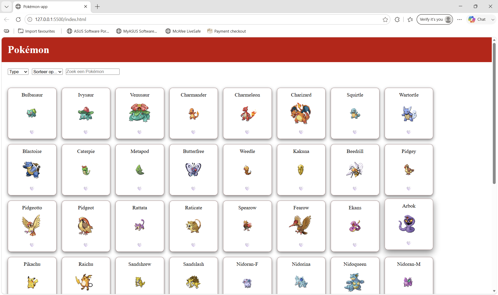

# Pokémon App

Een interactieve single-page webapplicatie gebouwd met Vite en de PokeAPI.

## Projectbeschrijving

Deze app toont 30 Pokémon met hun afbeelding, naam en type. Gebruikers kunnen zoeken, filteren op type, sorteren op naam of ID, en Pokémon toevoegen aan hun favorieten. Favorieten worden bewaard tussen sessies via LocalStorage.

## Functionaliteiten

- 50 Pokémon ophalen van de PokeAPI
- Zoekfunctie op naam
- Filteren op type
- Sorteren op naam (A-Z) of ID
- Favorieten toevoegen/verwijderen met hartje
- Favorieten bewaard tussen sessies via LocalStorage
- Fade-in animatie via IntersectionObserver
- Hover animatie op kaartjes

## Gebruikte API

- **PokeAPI**: https://pokeapi.co/
  - Endpoint: `https://pokeapi.co/api/v2/pokemon?limit=50`
  - Detail endpoint: `https://pokeapi.co/api/v2/pokemon/{id}`

## Technische vereisten

### DOM Manipulatie
- **Elementen selecteren**: `main.js` lijn 8 - `document.getElementById('search')`
- **Elementen manipuleren**: `ui.js` lijn 7 - `card.classList.add('card')`
- **Events koppelen**: `main.js` lijn 9 - `search.addEventListener('input', ...)`

### Modern JavaScript
- **Constanten**: `api.js` lijn 3 - `const response = await fetch(...)`
- **Template literals**: `ui.js` - `pokemon.name` in textContent
- **Iteratie over arrays**: `ui.js` lijn 28 - `pokemonList.forEach(...)`
- **Array methodes**: `main.js` lijn 11 - `allePokemon.filter(...)`
- **Arrow functions**: doorheen de hele applicatie
- **Ternary operator**: `ui.js` lijn 23 - `isFavoriet ? saveFavorite(pokemon) : deleteFavorite(pokemon)`
- **Callback functions**: `main.js` lijn 9 - callback in addEventListener
- **Promises**: `main.js` lijn 6 - `Promise.all(...)`
- **Async & Await**: `api.js` lijn 1 - `async function fetchPokemon()`
- **Observer API**: `ui.js` lijn 27 - `new IntersectionObserver(...)`

### Data & API
- **Fetch**: `api.js` lijn 3 - `await fetch('https://pokeapi.co/api/v2/pokemon?limit=30')`
- **JSON manipuleren**: `api.js` lijn 4 - `await response.json()`

### Opslag & Validatie
- **LocalStorage**: `storage.js` - `localStorage.setItem('favorite', ...)`

### Styling & Layout
- **CSS Grid**: `style.css` - `#pokemon-grid` met `display: grid`
- **Flexbox**: `style.css` - `#controls` met `display: flex`

### Tooling & Structuur
- **Vite**: project opgezet met `npm create vite@latest`
- **Folderstructuur**:
```
pokemon-app/
├── public/
├── src/
│   ├── api.js
│   ├── ui.js
│   ├── storage.js
│   ├── main.js
│   └── style.css
├── index.html
└── package.json
```

## Installatiehandleiding

1. Clone de repository:
```bash
git clone https://github.com/jouw-gebruikersnaam/pokemon-app.git
```

2. Navigeer naar de map:
```bash
cd pokemon-app
```

3. Installeer de dependencies:
```bash
npm install
```

4. Start de development server:
bash
npm run dev

5. Open je browser op `http://localhost:5173`

## Screenshots


## Gebruikte bronnen

- PokeAPI documentatie (https://pokeapi.co/docs/v2)
- Cursus Web Advanced (EHB)

